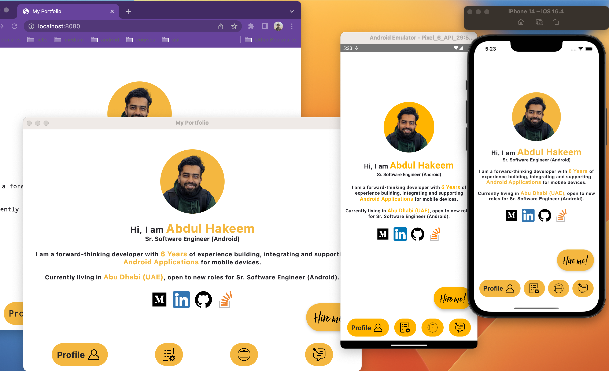
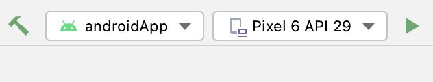
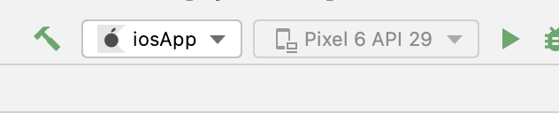
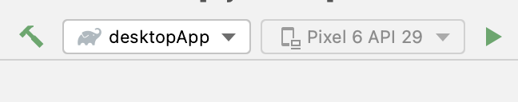

[](https://confluence.jetbrains.com/display/ALL/JetBrains+on+GitHub)
[](https://opensource.org/licenses/Apache-2.0)
# [Compose Multiplatform](https://github.com/JetBrains/compose-multiplatform) mobile application


## About The Project
A Portfolio App Made in Compose Multiplatfrom.
 

This repo contain 4 platfroms
* Android
* iOS
* Desktop App (JVM)
* Web

### Built With
* Kotlin
* Compose Multiplatform


### Android
 
#### How To Run
Select androidApp from the top drop down and tab run button


### iOS
 
#### How To Run
Select iosApp from the top drop down and tab run button


### Desktop App
 
#### How To Run
Select desktooApp from the top drop down and tab run button


### Web

#### How To Run
Go to root directory of the project and execute
```sh
   ./gradlew :webApp:wasmRun
   ```

